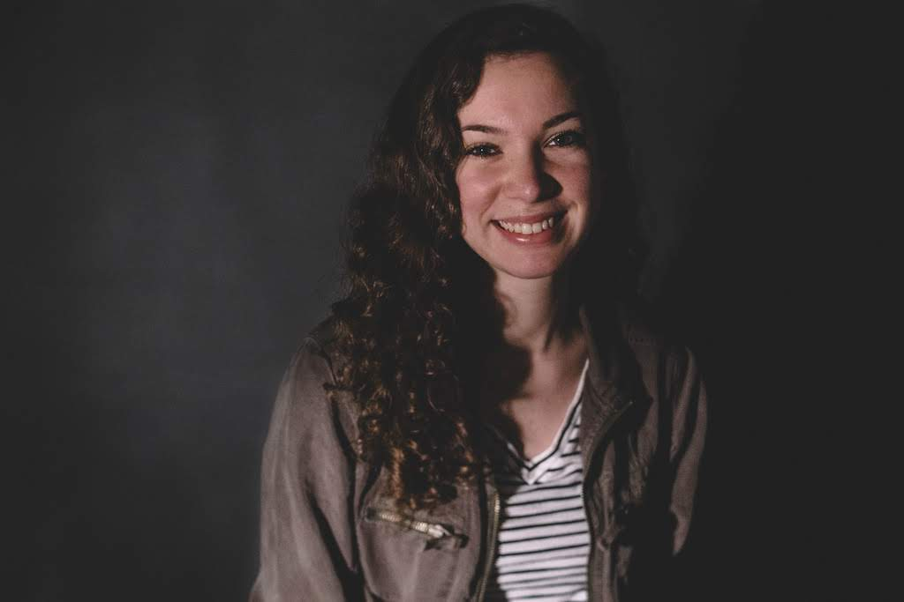

MPH in Epidemiology Candidate 
Certificate in Infectious Disease Epidemiology 
Columbia University Mailman School of Public Health

## Public Health

I am currently a student studying public health, and more specifically Epidemiology. I am currently doing research with various ICAP faculty, including my academic advisor, Dr. Susan Michaels-Strasser. I began doing public health research in the summer of 2020 and have so far worked on projects regarding epidemic control of HIV/AIDS in Democratic Republic of the Congo and rural rotations of nursing students in Democratic Republic of the Congo.

I am currently working on my thesis project, which is aimed to be published in the spring or summer of 2021. The project is about the experience of healthcare workers at Columbia University's Medical Center during the COVID-19 pandemic. The focus of the project is to examine how mental health of healthcare workers in hard-hit New York City relates to the time worked during the pandemic, certain demographic characteristics, and infection prevention and control training received specifically for the pandemic.

## Education

I received my undergraduate education at James Madison University in Harrisonburg, Virginia. I graduated in May 2019 with a Bachelors of Science in Health Science and a concentration in Health Studies. Many of the classes I took in my major were focused on public health. I also took classes in chemistry, biology, and various general education areas.

I am currently working to receive my Masters in Public Health in Epidemiology at Columbia University Mailman School of Public Health. I will have a certificate in Infectious Disease Epidemiology. I am aiming to graduate in April 2021. The classes I have taken while at Columbia thus far have spanned from core public health classes to focused epidemiology and biostatistics courses.

## Contact Information

For more information about my professional and educational experience, check the links in the header of this website or check the various tabs in the header. I can also be reached at the following contact information below:

Email: rch2155@cumc.columbia.edu 
Phone: +1-703-401-0482
